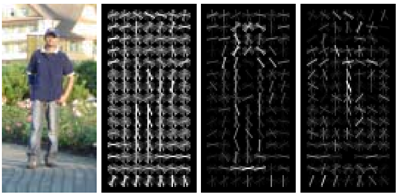

 
(Example face detection results from anXDdd.)

# Project 4: Face detection with a sliding window

* VL Feat Matlab reference: <a href="http://www.vlfeat.org/matlab/matlab.html">http://www.vlfeat.org/matlab/matlab.html</a>

##Overview

The sliding window model is conceptually simple: independently classify all image patches as being object or non-object. Sliding window classification is the dominant paradigm in object detection and for one object category in particular -- faces -- it is one of the most noticeable successes of computer vision. For example, modern cameras and photo organization tools have prominent face detection capabilities. These success of face detection (and object detection in general) can be traced back to influential works such as <a href="http://www.informedia.cs.cmu.edu/documents/rowley-ieee.pdf">Rowley et al. 1998</a> and <a href="https://www.cs.cmu.edu/~efros/courses/LBMV07/Papers/viola-cvpr-01.pdf">Viola-Jones 2001</a>. You can look at these papers for suggestions on how to implement your detector. However, for this project you will be implementing the simpler (but still very effective!) sliding window detector of <a href="http://lear.inrialpes.fr/people/triggs/pubs/Dalal-cvpr05.pdf">Dalal and Triggs 2005</a>. Dalal-Triggs focuses on representation more than learning and introduces the SIFT-like Histogram of Gradients (HoG) representation (pictured to the right). Because you have already implemented the SIFT descriptor, you will not be asked to implement HoG. You will be responsible for the rest of the detection pipeline, though -- handling heterogeneous training and testing data, training a linear classifier (a HoG template), and using your classifier to classify millions of sliding windows at multiple scales. Fortunately, linear classifiers are compact, fast to train, and fast to execute. A linear SVM can also be trained on large amounts of data, including mined hard negatives. 

##Details and Starter Code

The following is an outline of the stencil code:
  <ul>
	<li><code>proj4.m</code>. The top level script for training and testing your object detector. If you run the code unmodified, it will predict random faces in the test images. It calls the following functions, many of which are simply placeholders in the starter code:</li>	
    <li><code>get_positive_features.m </code> (you code this). Load cropped positive trained examples (faces) and convert them to HoG features with a call to <code>vl_hog</code>.</li>
    <li><code>get_random_negative_features.m</code> (you code this). Sample random negative examples from scenes which contain no faces and convert them to HoG features.</li>
    <li><code>classifier training</code> (you code this). Train a linear classifier from the positive and negative examples with a call to <code>vl_trainsvm</code>.</li>
    <li><code>run_detector.m</code> (you code this). Run the classifier on the test set. For each image, run the classifier at multiple scales and then call <code>non_max_supr_bbox</code> to remove duplicate detections.</li>
    <li><code>evaluate_detections.m</code>. Compute ROC curve, precision-recall curve, and average precision. You're not allowed to change this function.</li>
	 <li><code>visualize_detections_by_image.m</code>. Visualize detections in each image. You can use <code>visualize_detections_by_image_no_gt.m</code> for test cases which have no ground truth annotations (e.g. the class photos).</li>
</ul>

Creating the sliding window, multiscale detector is the most complex part of this project. It is recommended that you start with a <i>single scale</i> detector which does not detect faces at multiple scales in each test image. Such a detector will not work nearly as well (perhaps 0.3 average precision) compared to the full multi-scale detector. With a well trained multi-scale detector with small step size you can expect to match the papers linked above in performance with average precision above 0.9.

## Data

The choice of training data is critical for this task. While an object detection system would typically be trained and tested on a single database (as in the Pascal VOC challenge), face detection papers have traditionally trained on heterogeneous, even proprietary, datasets. As with most of the literature, we will use three databases: (1) positive training crops, (2) non-face scenes to mine for negative training data, and (3) test scenes with ground truth face locations.

You are provided with a positive training database of 6,713 cropped 36x36 faces from the <a href="http://www.vision.caltech.edu/Image_Datasets/Caltech_10K_WebFaces/">Caltech Web Faces project</a>. We arrived at this subset by filtering away faces which were not high enough resolution, upright, or front facing. There are many additional databases available For example, see Figure 3 in <a href="http://vis-www.cs.umass.edu/lfw/lfw.pdf">Huang et al.</a> and the <a href="http://vis-www.cs.umass.edu/lfw/">LFW database</a> described in the paper. You are free to experiment with additional or alternative training data for extra credit.

Non-face scenes, the second source of your training data, are easy to collect. We provide a small database of such scenes from <a href="http://cs.nju.edu.cn/wujx/RareEvent/rare_event.htm">Wu et al.</a> and the <a href="http://groups.csail.mit.edu/vision/SUN/">SUN scene database</a>. You can add more non-face training scenes, although you are unlikely to need more negative training data unless you are doing hard negative mining for extra credit.

The most common benchmark for face detection is the CMU+MIT test set. This test set contains 130 images with 511 faces. The test set is challenging because the images are highly compressed and quantized. Some of the faces are illustrated faces, not human faces. For this project, we have converted the test set's ground truth landmark points in to Pascal VOC style bounding boxes. We have inflated these bounding boxes to cover most of the head, as the provided training data does. For this reason, you are arguably training a "head detector" not a "face detector" for this project.

Copies of these data sets are provided with your starter code and are available in <tt>/course/cs143/asgn/proj4/data</tt>. You probably want to make a local copy of these to speed up training and testing, but please do <i>not</i> include them in your handin.

## Writeup
For this project, and all other projects, you must do a project report in results folder using [Markdown](https://help.github.com/articles/markdown-basics). We provide you with a placeholder [index.md](./results/index.md) document which you can edit. In the report you will describe your algorithm and any decisions you made to write your algorithm a particular way. Then, you will describe how to run your code and if your code depended on other packages. You also need to show and discuss the results of your algorithm. Discuss any extra credit you did, and clearly show what contribution it had on the results (e.g. performance with and without each extra credit component).

You should show how your detector performs on additional images in the <code>data/extra_test_scenes</code> directory.

You should also include the precision-recall curve of your final classifier and any interesting variants of your algorithm.

##Extra Credit 

For all extra credit, be sure to analyze on your index.md  file cases whether your extra credit has improved classification accuracy. Each item is "up to" some amount of points because trivial implementations may not be worthy of full extra credit.  
Some ideas:

<ul>
  <li>up to 5 pts: Implement hard negative mining, as discussed in Dalal and Triggs, and demonstrate the effect on performance.
  <li>up to 5 pts: Implement a HoG descriptor yourself.</li>
  <li>up to 5 pts: Implement a cascade architecture as in Viola-Jones. Show the effect that this has on accuracy and run speed. Describe your cascade building process in detail in your handout. Unfortunately, with the current starter code this is unlikely to improve run speed because the run time is dominated by image and feature manipulations, not the already fast linear classifier.</li>
  <li>up to 5 pts: Detect additional object categories. You'll need to get your own training and testing data. One suggestion is to train and run your detector on the Pascal VOC data sets, possibly with the help of their support code. The bounding boxes returned by the stencil code are already in VOC format.</li>
  <li>up to 3 pts: Interesting features and combinations of features. Be creative!</li>
  <li>up to 3 pts: Find and utilize alternative positive training data. You can either augment or replace the provided training data.</li>
  <li>up to 3 pts: Use additional classification schemes (e.g. full decision trees, neural nets, or nearest neighbor methods).</li>
  <li>up to 5 pts: Add contextual reasoning to your classifier. For example, one might learn likely locations of faces given scene statistics, in the spirit of <a href="http://web.mit.edu/torralba/www/carsAndFacesInContext.html">Contextual priming for object detection, Torralba</a>. You could try and use typical arrangements of groups of faces as in <a href="http://amp.ece.cornell.edu/people/Andy/Andy_files/cvpr09.pdf">Understanding Images of Groups of People</a> and <a href="http://amp.ece.cornell.edu/people/Andy/Andy_files/Gallagher_icme09_rows2.pdf">Finding Rows of People in Group Images</a> by Gallagher and Chen.</li>
  <li>up to 5 pts: Use deformable models instead of fixed templates as in the work of <a href="http://www.cs.berkeley.edu/~rbg/latent/index.html">Felzenszwalb et al.</a></li>
  <li>2 pts: If you make your code publicly available.</li>
<li>2 pts: If you comment on pull request from students who fork the homework.</li>
</ul>

Finally, there will be extra credit and recognition for the students who achieve the highest average precision. You aren't allowed to modify <code>evaluate_all_detections.m</code> which measures your accuracy.

## Credits
Assignment modified by Min Sun based on codes from James Hays. Figures in this handout are from <a href="http://lear.inrialpes.fr/people/triggs/pubs/Dalal-cvpr05.pdf">Dalal and Triggs</a>.
