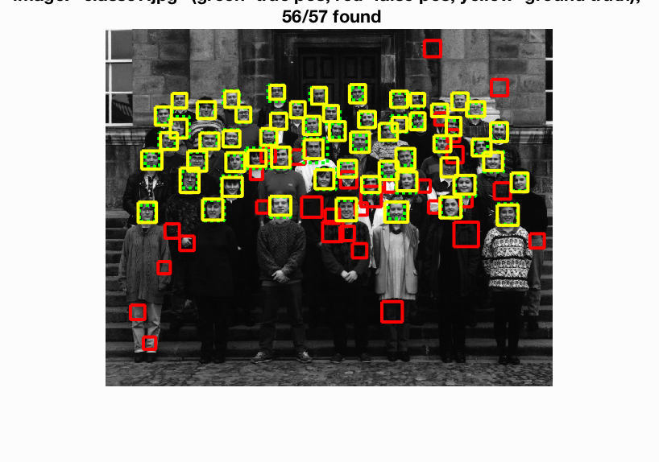
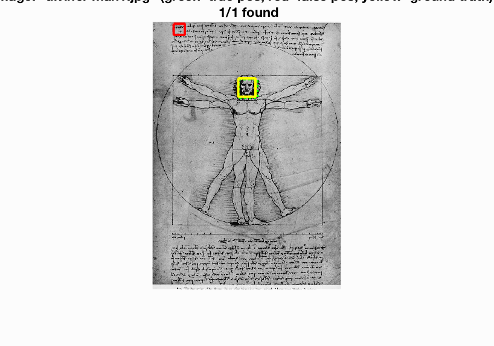

# 張植鈞 <span style="color:red">(student ID: 102061214)</span>

#Project 4 / Face Detection with a Sliding Window

## Overview

In this project, we are responsible for handling heterogeneous training and testing data to train a linear classifier(a HoG template), and use the classifier to classify millions of sliding windows at multiple scales.

## Implementation

1.Get Positive Features(get_positive_features.m)

Load many pictures of faces as positive trained examples and convert them to HoG features.(use ```vl_hog```)

Algorithm:

```
for i = 1 to {number of train positive images}
    img = read in the image
    hog_feats = vl_hog(img, feature_params.hog_cell_size)
    features_pos(i ,:) = hog_feats
end
return features_pos
```

See get_positive_features.m for more details.

2.Get Some Negative Features Exampes(get_random_negative_features.m)

Sample random negative examples from scenes which contain no faces and convert them to HoG features, and try to sample random negative examples(random crop the image) at multiple scales for best performance.

Algorithm:

```
declare number of samples in each image
for i = 1 to {number of train negative images}
    img = read in the image
    for j = 1 to {number of samples in each image}
        crop = random crop img
        hog_feats = vl_hog(crop, feature_params.hog_cell_size)
        features_neg(i ,:) = hog_feats
end
return features_neg
```

See get_random_negative_features.m for more details.

3.Begin to Training

Label positive features 1, negative features -1 and use them to train a linear SVM classifier.

Codes:

```
lambda = 0.0001;
feats  = [features_pos; features_neg];
label  = [ones(size(features_pos,1),1); -1*ones(size(features_neg,1),1)];
[w, b] = vl_svmtrain(feats', label, lambda);
```

4.Move on the Test Data(run_detector.m)

Run the SVM classifier on the test set. First, resize the image to different scale and then slide to get different features in every position. With these features and w, b getting from the classifier, it's easy to calculate the scores. At last, call non_max_supr_bbox to remove duplicate detections and record the region which has max score.

Algorithm:

```
for i = 1 to {number of test image}
    img = read in the image and change it to gray scale
    for scale in {different scales}
        scaled_img = resize img to scale
        hog_feats = vl_hog(crop, feature_params.hog_cell_size)
        x, y = number of sliding times in x and y directoin
        feats_in_windows = slide the window and record the features
        scores = feats_in_windows * w +b
        index = find the max scores index
        use the index to calculate bbox coordinates
        record bboxes, confidences, and image id with index
    end
    max = non_max_supr_bbox(bboxes, confidences, size(img));
    bboxes = bboxes(max)
    confidences = confidences(max)
    image id = image id(max)
end
return bboxes, confidencesm image id 
```

See run_detector.m for more details.

## Installation
* Other required packages.

> vlfeat package

* How to compile from source?

> run proj4.m in MATLAB

### Results

<center>
<p>
Face template HoG visualization
<p>

<p>
Precision Recall curve.
<p>

<p>
Example of detection on the test set.
<p>
yellow is ground truth; green is true positive; red is false positive
<p>

<table border=1>
<tr>
<td>


</td>
</tr>

<tr>
<td>


</td>
</tr>

<tr>
<td>



</td>
</tr>

<tr>
<td>


</td>
</tr>

<tr>
<td>



</td>
</tr>

<tr>
<td>


</td>
</tr>

</table>

Result of extra test scenes
<p>

<p>

<p>

<p>

</center>
